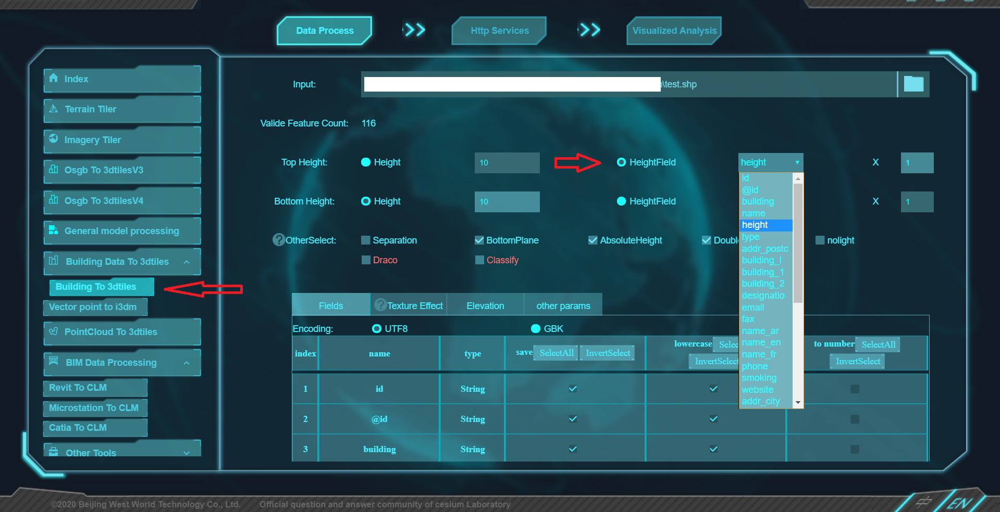

# Cesium & CesiumLab


CesiumJS est une bibliothèque JavaScript permettant de créer des globes 3D et des cartes 2D dans un navigateur web sans plugin.


Ce tuto utilise CesiumLab a third party software developpé par Beijing West World Technology Co., Ltd. 
qui fait du traitement de données gratuit spécifiquement conçu pour la plate-forme numérique open source Cesium.

# Aperçu

Dans ce Didacticiel nous allons créer une application simple pour visualiser la couche bâtiment 3D d'une zone géographique de notre
choix. Nous allons charger les données 3DTiles et appliquer un style suivant une classification
par hauteur de bâtiment, type etc…


# Installation

Quelques étapes de configuration avant de pouvoir passer au développement.

•Installer [Node.js](https://nodejs.org/en/).

•Installer CesiumLab en cliquant [ici](http://www.cesiumlab.com/app/cesiumlab2_2.3.8.exe) ou en visitant le [site web](http://www.cesiumlab.com/)
officiel du logiciel.

•Obtenez le code du didacticiel. Clonez ou téléchargez le zip et extraire le contenu.

•Dans votre console, accédez au répertoire du projet cesium-cesiumlab.

•Executez la commande `npm install`.

•Executez la commande `npm start`.

La console doit afficher ce qui suit.

Copier dans le presse-papier.Presse-papiers copiés de données.

`Cesium development server running locally.  Connect to http://localhost:8080`

# Acquisition de données sur les bâtiments urbains

Les données sur les bâtiments urbains désignent le plan général des bâtiments d'une ville. Elles sont différentes des règles détaillées et des dessins de contrôle d'un bâtiment.
Il s'agit du plan de tous les bâtiments de la ville. Le plan peut être simplement un rectangle ou un polygone. La zone, qui représente un bâtiment dans cette zone, ne nécessite pas d'informations détaillées.

Pour obtenir les données on va utiliser les données vecteurs gratuits de la couche bâtiment à partir de [OSM-Buildings](https://osmbuildings.org/).
Naviguer vers votre zone géographique de choix [ici](https://overpass-turbo.eu/) et exporter les données en format
`.geojson` pour les tuiler ensuite dans CesiumLab.

#Modelisation 3D des données 
Comme 1ère étape on va convertir les données acquises en shapefile format `.shp` avec CesiumLab de la manière suivante :

(NB qu'il faut d'abord changer la langue en EN en cliquant en bas à droite et créer un compte pour continuer l'utilisation du logiciel)


#### SHP -> Modélisation 3DTILES
Avec CesiumLab cette procédure est simple c'est directe en une seule étape mais il y a quelques prérequis.

1. Le format de données SHP est de préférence géoréférncé dans le système de coordonnées WGS84.
2. Il existe des attributs de hauteur numériques dans le champ d'attribut.
3. Le codage du fichier est de préférence UTF-8.


Une fois terminé les fichiers de format suivants sont générés:

pour des raisons de limite de taille ces fichiers ne seront pas téléchargés dans cette repo.

# Visualisation 3D de modèles de bâtiments urbains

Les données sont prêtes à être chargé dans Cesium. Nous devons maintenant les mettre dans notre serveur local créé précédemment.

Dans le code on doit ajouter le script suivant:
````js
var viewer = new Cesium.Viewer('cesiumContainer', {
        scene3DOnly: true,
        selectionIndicator: false,
        baseLayerPicker: false,
    });
    viewer.imageryLayers.remove(viewer.imageryLayers.get(0));


    var tileset = new Cesium.Cesium3DTileset({
        url: "./Source/SampleData/tunistiled3d/tileset.json",
    });
    viewer.scene.primitives.add(tileset);
    viewer.zoomTo(tileset);
````
↓


Vous pouvez également ajouter une couche imagery avec cesium ion avec la ligne du code suivante :

```js 
viewer.imageryLayers.addImageryProvider(new Cesium.IonImageryProvider({ assetId: 2 })); 
```
N'oubliez pas d'ajouter votre token CesiumIon si vous souhaitez ajouter cette étape.(``{ assetId: 2 }`` est la couche imagery de bing maps)
.

### 3D tiles styiling

Pour le style des bâtiments nous allons faire une classification par hauteur et par type de bâtiment.

le code est le suivant :

```js
var heightStyle = new Cesium.Cesium3DTileStyle({
color : {
conditions : [
["${height} <= 10 ", "color('yellow',0.6)"],
["${height} >= 15 && ${height} < 30", "color('green',0.7)"],
["${height} >= 20 && ${height} < 40", "color('blue',0.8)"],
["${height} > 30", "color('purple',0.9)"],

                ["true", "color('white')"],
            ]
        }
    });
    var typeStyle = new Cesium.Cesium3DTileStyle({
        color : {
            conditions : [
                ["${building} === 'university'", "color('green')"],
                ["${building} === 'office' ", "color('blue')"],
                ["${building} === 'house' ", "color('lightgreen')"],
                ["${building} === 'apartements' ", "color('red')"],
                ["true", "color('white')"],
            ]
        },
        show : true
    });
    // Define a white, transparent building style
    var transparentStyle = new Cesium.Cesium3DTileStyle({
        color : "color('white')",
        show : true
    });
```
Et comme dernière étape qui va nous permettre de voir la différence entre les styles dans la même interface c'est d'ajouter des boutons qui vont se charger de cette tâche.

Dans `index.html` ajoutez :

```html
<div class="backdrop" id="menu">
            <h2>Tunis-Tunisia</h2>
            <span><strong>Type de classification</strong></span>
            <div class="nowrap">
                <input id="normalMode" name="source" type="radio" checked/>
                <label for="normalMode">mode simple </label>
            </div>
            <div class="nowrap">
                <input id="heightMode" name="source" type="radio" />
                <label for="heightMode">height classification</label>
            </div>
            <div class="nowrap">
                <input id="buildMode" name="source" type="radio"/>
                <label for="buildMode">building classification</label>
            </div>


        </div>
```

Ajoutez maintenant la partie script dans ``App.js``

```js
var topModeElement = document.getElementById('heightMode');
    var buildModeElement = document.getElementById('buildMode');
    var normalModeElement = document.getElementById('normalMode');

    // Create a follow camera by tracking the drone entity
    function setViewMode() {
        if (topModeElement.checked) {
            tileset.style = heightStyle;

        }else if(buildModeElement.checked) {
            tileset.style = typeStyle;
        }
        else {
            tileset.style = transparentStyle;
        }
    }
    topModeElement.addEventListener('change', setViewMode);
    buildModeElement.addEventListener('change', setViewMode);
    normalModeElement.addEventListener('change', setViewMode);
   ```
<p align="center"> ⬇  </p>


